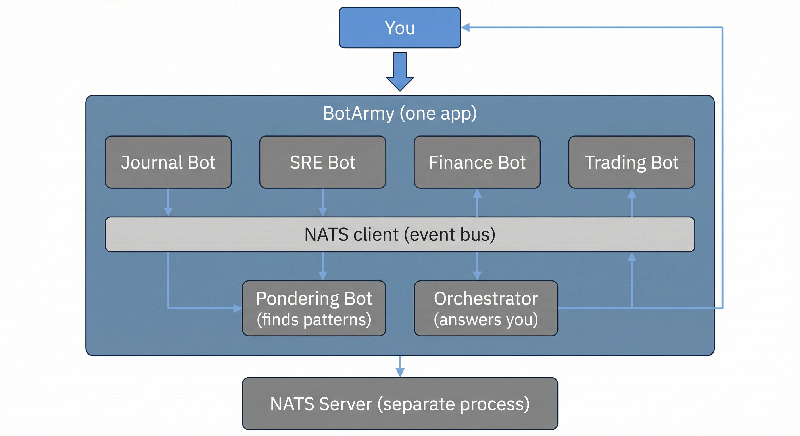

# BotArmy Learning Guide

**For you:**  
- Barely know Elixir (or learning).  
- Know Kubernetes enough to run things but not the exact commands.  
- Short attention span welcome — we use bullets, diagrams, and short sections.

**Goal:** Understand what each part of this project does and *why* it’s set up that way, so you can talk about it in an interview and change it with confidence.

---

## How to use this guide

- **Jump around.** Use the table of contents; you don’t have to read in order.
- **Short sections.** Each part is a few minutes max.
- **Bullets and diagrams.** Skim those first, then read details if you want.
- **“Why” callouts.** Look for **💡 Why?** — that’s the reasoning behind the code/setup.

---

## Table of contents

| Topic | What you’ll get | Time |
|-------|-----------------|------|
| [What is this project?](#1-what-is-this-project) | One picture of the whole system | ~2 min |
| [Elixir & OTP in plain English](#2-elixir--otp-in-plain-english) | GenServer, Supervisor, behaviours | ~5 min |
| [NATS and the event bus](#3-nats-and-the-event-bus) | How bots talk without knowing each other | ~4 min |
| [Kubernetes: commands and why](#4-kubernetes-commands-and-why) | `kubectl` you’ll use + what each YAML does | ~5 min |
| [Makefile and project setup](#5-makefile-and-project-setup) | What each `make` target does and why | ~3 min |
| [Flow: from keypress to insight](#6-flow-from-keypress-to-insight) | One request walking through the app | ~3 min |

---

## 1. What is this project?

**In 30 seconds:** Several small “bots” (Elixir processes) run in one app. They don’t call each other directly. They publish and subscribe to **events** on a **message bus (NATS)**. One bot “ponders” in the background and publishes insights; another answers your questions using those insights.

### The big picture



**Same idea in text:**

```
  YOU
   │
   │  "What insights do you see?"
   │  or: journal("Had a great day", "happy")
   ▼
┌─────────────────────────────────────────────────────────────┐
│  BotArmy (one Elixir app, one OS process, ~100MB RAM)        │
│                                                              │
│  ┌──────────┐ ┌──────────┐ ┌──────────┐ ┌──────────┐        │
│  │ Journal  │ │ SRE      │ │ Finance  │ │ Trading  │  …     │
│  │ Bot      │ │ Bot      │ │ Bot      │ │ Bot      │        │
│  └────┬─────┘ └────┬─────┘ └────┬─────┘ └────┬─────┘        │
│       │            │            │            │               │
│       └────────────┴────────────┴────────────┘               │
│                        │                                      │
│                        ▼                                      │
│              ┌─────────────────┐                             │
│              │  NATS (in-app   │  ←── event bus               │
│              │  client only)   │                             │
│              └────────┬────────┘                             │
│                       │                                       │
│         ┌─────────────┼─────────────┐                        │
│         ▼             ▼             ▼                        │
│  ┌────────────┐ ┌──────────┐ ┌────────────┐                │
│  │ Pondering  │ │Orchestrat.│ │  (you ask   │                │
│  │ Bot        │ │           │ │  & get     │                │
│  │ (pattern   │ │ (answers  │ │  answers)  │                │
│  │  finder)   │ │  you)    │ │             │                │
│  └────────────┘ └──────────┘ └────────────┘                │
└─────────────────────────────────────────────────────────────┘
                        │
                        │  TCP (to a NATS server)
                        ▼
              ┌─────────────────┐
              │  NATS Server    │  ←── can be local or in K8s
              │  (separate      │
              │   process)      │
              └─────────────────┘
```

**Takeaways:**

- **One app, many “bots”.** Each bot is a GenServer: stateful, long‑lived, does one job.
- **Communication = events.** Bots publish and subscribe by **subject** (e.g. `journal.entry.created`). No direct “call JournalBot” from SREBot.
- **NATS** = the message broker. The app uses the **Gnat** client to talk to a NATS server (Docker or Kubernetes).

**💡 Why an event bus?** So we can add or remove bots without them knowing about each other. New bot = new subscriber. Good for learning and for scaling later.

---

## 2. Elixir & OTP in plain English

**In 30 seconds:** The app uses **OTP**: GenServers (workers) and a Supervisor (restarts them if they crash). The **Bot** module is a **behaviour**: a contract so every bot implements the same callbacks.

### Concepts that show up in this project

| Term | What it is (plain English) | Where you see it |
|------|----------------------------|-------------------|
| **GenServer** | A process that keeps state and handles messages (sync/async) | Every bot is a GenServer |
| **Supervisor** | A process that starts children and restarts them if they crash | `BotArmy.Application` starts a Supervisor |
| **Behaviour** | A “contract”: list of functions a module must implement | `BotArmy.Bot` – each bot implements `bot_name/0`, `subscribe_patterns/0`, `handle_event/1` |
| **`use BotArmy.Bot`** | Injects GenServer + subscription logic so you only write bot-specific code | Top of each bot module |

### How the app starts (supervision tree)

```
Application.start
       │
       ▼
  Supervisor (strategy: one_for_one)
       │
       ├── Gnat.ConnectionSupervisor  ← NATS connection
       ├── JournalBot
       ├── SREBot
       ├── FinanceBot
       ├── TradingBot
       ├── PonderingBot
       └── Orchestrator
```

**💡 Why one_for_one?** If one bot crashes, only that bot restarts. The others keep running. Simple and predictable.

### What the Bot behaviour gives you

When you write `use BotArmy.Bot`, you get:

- **GenServer** boilerplate (start_link, init, name registration).
- **Subscribe** to NATS patterns in `init` from `subscribe_patterns()`.
- **handle_info({:msg, ...})** that decodes the message and calls your `handle_event/1`.
- **publish_event(subject, data)** helper.

You only implement:

- `bot_name/0` – atom for logging/source.
- `subscribe_patterns/0` – list of NATS subject patterns (e.g. `["journal.>"]`).
- `handle_event(event)` – what to do when an event arrives.

**💡 Why a behaviour?** So every bot looks the same from the outside and we don’t duplicate subscription/publish logic in six places.

---

## 3. NATS and the event bus

**In 30 seconds:** NATS is a **pub/sub** message broker. Bots **publish** events to **subjects** (e.g. `journal.entry.created`) and **subscribe** to patterns. They don’t need to know who is listening.

### Subject naming

We use **dot-separated** subjects:

- `journal.entry.created`
- `sre.alert.cpu`
- `finance.transaction.processed`
- `ponder.insight.detected`

Pattern: **`<domain>.<thing>.<action>`**.

**💡 Why dots?** NATS supports wildcards: `*` (one segment), `>` (rest of path). So `journal.>` means “everything under journal”.

### Subscription patterns in this app

| Bot | Subscribes to | Meaning |
|-----|----------------|---------|
| JournalBot | `journal.>` | All journal events |
| SREBot | `sre.>` | All SRE events |
| FinanceBot | `finance.>` | All finance events |
| TradingBot | `trading.>`, `market.>` | Trading and market |
| PonderingBot | `>` | **Everything** (so it can find cross-domain patterns) |
| Orchestrator | `>`, `ponder.>` | Everything + explicitly ponder insights |

### How one event reaches many bots

```
  JournalBot publishes "journal.entry.created"
              │
              ▼
        ┌──────────┐
        │  NATS    │
        │  Server  │
        └────┬─────┘
             │
     ┌───────┼───────┐
     ▼       ▼       ▼
  Journal  Pondering  Orchestrator
  (logs)   (buffers)  (caches for answers)
```

**💡 Why “event bus”?** So we can add listeners (new bots, new features) without changing the code that publishes. Good for learning and for future AI/analytics.

---

## 4. Kubernetes: commands and why

**In 30 seconds:** We use **Namespace**, **Deployment**, **Service**, **ConfigMap**. The Makefile runs `kubectl apply` for you. Here’s what each resource is for and the commands you’ll use.

### Commands you’ll actually run

| What you want | Command | Note |
|---------------|---------|------|
| Deploy everything (NATS + app) | `make k8s-deploy` | Uses `IMAGE` if set |
| Deploy only the app | `make k8s-deploy-app` | When NATS already exists |
| Deploy only NATS | `make k8s-deploy-nats` | Namespace + NATS |
| Remove everything in the project | `make k8s-destroy` | Deletes namespace `bot-army` |
| See pods | `kubectl get pods -n bot-army` | Are my containers running? |
| See logs | `kubectl logs -f deployment/bot-army -n bot-army` | Follow app logs |
| See NATS logs | `kubectl logs -f deployment/nats -n bot-army` | Follow NATS logs |

**💡 Why a Makefile?** So you don’t have to remember `kubectl apply -f deploy/kubernetes/...` and order of files. One command, same every time.

### What each YAML does (and why)

| File | Resource | What it is | Why we use it |
|------|----------|------------|----------------|
| `namespace.yaml` | Namespace | A folder for our app’s resources | So we don’t mix with other apps; easy to delete everything with `kubectl delete namespace bot-army`. |
| `nats.yaml` | Deployment + Service | Runs NATS container; exposes it on port 4222 inside the cluster | BotArmy needs a NATS server. Running it in the same namespace keeps networking simple (hostname `nats`). |
| `bot-army-configmap.yaml` | ConfigMap | Key-value config (e.g. `NATS_HOST=nats`, `NATS_PORT=4222`) | So we don’t bake config into the image. Same image can point to different NATS by changing the ConfigMap. |
| `bot-army-deployment.yaml` | Deployment | Runs the BotArmy app container; says “use ConfigMap for env” | Tells Kubernetes how many copies to run, which image, and where to get env vars. |

### How they fit together (picture)

```
  namespace: bot-army
  ┌─────────────────────────────────────────────────────────┐
  │  ConfigMap "bot-army"                                    │
  │    NATS_HOST=nats, NATS_PORT=4222                        │
  │  ─────────────────────────────────────────────────────  │
  │  Deployment "nats"          Service "nats"               │
  │    └─ Pod (NATS container)   └─ ClusterIP :4222, :8222   │
  │  ─────────────────────────────────────────────────────  │
  │  Deployment "bot-army"                                   │
  │    └─ Pod (bot-army container)                           │
  │         envFrom: configMapRef bot-army                    │
  │         → so app sees NATS_HOST=nats                      │
  └─────────────────────────────────────────────────────────┘
```

**💡 Why `NATS_HOST=nats` in K8s?** In the cluster, the NATS server is reachable by the **Service name** `nats` in the same namespace. So the app doesn’t need to know the pod IP.

---

## 5. Makefile and project setup

**In 30 seconds:** The Makefile is the single place for “how to run tests,” “how to start NATS,” “how to deploy to K8s.” Same commands on every machine.

### Targets and what they do

| Target | What it does | When to use it |
|--------|----------------|----------------|
| `make help` | Prints all targets | When you forget what’s available |
| `make deps` | `mix deps.get` | After clone or when deps change |
| `make nats` | Runs `./start_nats.sh` (NATS in Docker) | Before `iex -S mix` locally |
| `make run` | `iex -S mix` | Start the app in a REPL |
| `make test` | `mix test` | After changing code |
| `make check` | Compile + format check + test | Before commit / CI |
| `make docker-build` | Builds Docker image (`IMAGE` or default) | Before `docker-run` or push |
| `make docker-run` | Runs container; uses `NATS_HOST=host.docker.internal` if not set | Run app in Docker with NATS on host |
| `make k8s-deploy` | Applies namespace, NATS, configmap, deployment | Deploy to Kubernetes |

**💡 Why `host.docker.internal` for docker-run?** When the app runs inside Docker, “localhost” is the container. NATS is on the host. `host.docker.internal` is the host’s address from inside the container (on Mac/Windows Docker).

### Project layout (only what matters for learning)

```
bot_army/
├── lib/bot_army/
│   ├── application.ex   ← Starts Supervisor + NATS + all bots
│   ├── bot.ex           ← Behaviour + use macro (shared bot logic)
│   ├── event.ex         ← Event struct, encode/decode JSON
│   ├── demo.ex          ← Functions you call from IEx (journal, ask, …)
│   └── bots/            ← One module per bot
├── config/              ← Compile-time config (we use runtime env for NATS)
├── deploy/kubernetes/   ← K8s YAMLs
├── mix.exs              ← App definition, deps, release
├── Dockerfile           ← Multi-stage build → small runtime image
├── Makefile             ← Commands for dev and deploy
└── .env.example         ← Env vars (copy to .env; not committed)
```

**💡 Why read env in Application.start?** So we can change NATS host/port without recompiling. Same binary works locally (localhost) and in K8s (NATS_HOST=nats).

---

## 6. Flow: from keypress to insight

**In 30 seconds:** You type a command in IEx → Demo calls a bot → bot publishes to NATS → NATS delivers to subscribers → PonderingBot buffers, then every 5 minutes analyzes and publishes insights → Orchestrator caches events and insights → you ask “what insights?” → Orchestrator answers from cache.

### Example: you create a journal entry

```
1. You:  BotArmy.Demo.journal("Great day", "happy")
2. Demo calls JournalBot.create_entry("Great day", "happy")
3. JournalBot publishes event:
     subject: "journal.entry.create"
     data: %{content: "Great day", mood: "happy", ...}
4. NATS sends that message to every subscriber of "journal.>" or ">"
5. JournalBot (as subscriber) gets it back:
     handle_event → logs it, publishes "journal.entry.created"
6. PonderingBot (subscribed to ">") gets both events → adds to event_buffer
7. Orchestrator (subscribed to ">") gets them → adds to recent_events cache
```

### Example: 5 minutes later, PonderingBot finds a pattern

```
1. Timer fires in PonderingBot → :ponder message
2. analyze_events(event_buffer) runs (e.g. "many journal entries in short time")
3. PonderingBot publishes "ponder.insight.detected" with insight data
4. Orchestrator receives it → adds to insights list
5. You:  BotArmy.Demo.ask("What insights?")
6. Orchestrator looks at recent_events + insights → builds answer → returns to you
```

So: **events** connect everything; **PonderingBot** turns event streams into insights; **Orchestrator** turns insights + events into answers for you.

---

## Quick reference

- **Run locally:** `make nats` then `make run` → in IEx: `BotArmy.Demo.run_demo()`
- **Add a new bot:** New module under `lib/bot_army/bots/` with `use BotArmy.Bot`, implement the three callbacks, add to `application.ex` children.
- **Deploy to K8s:** Build and push image, then `make k8s-deploy IMAGE=your-registry/bot-army:tag`
- **Env vars:** Copy `.env.example` to `.env`; for K8s, edit `deploy/kubernetes/bot-army-configmap.yaml`.

---

*If you want more depth on one part, open the specific doc in `docs/` or the main README and ARCHITECTURE.md.*
